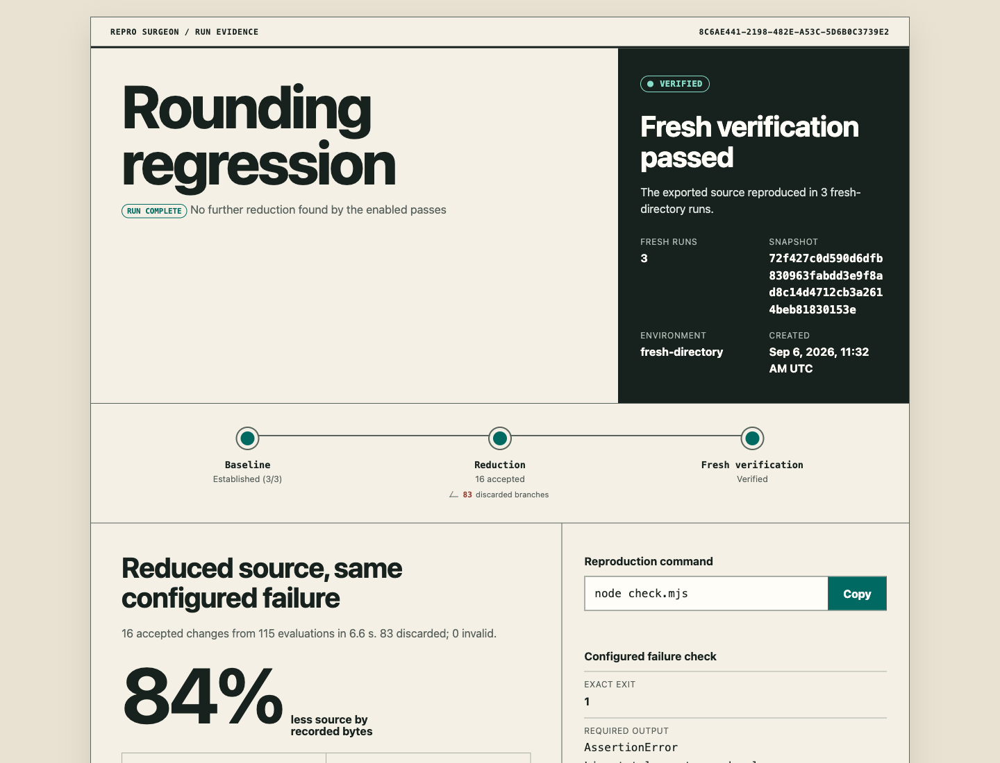

# Repro Surgeon

**Shrink the project. Keep the failure. Hand over something runnable.**

[](https://github.com/pavangupta352/repro-surgeon/actions/workflows/ci.yml)
[](LICENSE)

“Can you provide a minimal reproduction?” is often the hardest part of a bug report.

Repro Surgeon takes a failing npm application, removes source that isn't needed for your failure check, and exports a smaller project with its own verifier. It tests every accepted change and checks the export again with a fresh dependency installation. Your original project stays in place.

No account. No telemetry. Source and reports stay local.



*Actual bundled demonstration: 3,173 → 520 source bytes, 10 → 5 files, 115 evaluations. The assertion remains pinned. This is a small seeded example, not a framework benchmark. [Method and evidence](docs/validation.md).*

## Try it

Requires **Node.js 22.18+ and npm 10+**, on Linux or macOS.

```sh
git clone https://github.com/pavangupta352/repro-surgeon.git
cd repro-surgeon
npm ci
npm run build

node dist/cli.js reduce examples/rounding --out /tmp/rounding-repro
node /tmp/rounding-repro/repro/.repro/verify.mjs
```

Choose a new output directory for each run. Open `/tmp/rounding-repro/report.html` to inspect the result. The verifier exits successfully when the application's **expected failure** occurs; the original application command still exits with its configured failure code.

Install the packaged release for your own projects:

```sh
npm install --global https://github.com/pavangupta352/repro-surgeon/releases/download/v0.1.0/repro-surgeon-0.1.0.tgz
```

## Reduce your application

Start from a project whose failure reproduces with a finite command and a committed npm lockfile.

```sh
repro-surgeon init ./my-app \
  --match "the distinctive diagnostic from your failure" \
  -- npm run build

repro-surgeon doctor ./my-app --json
repro-surgeon reduce ./my-app --out ./my-app-repro
```

Replace the example diagnostic with text from your actual error. Use several `--match` fragments to identify it precisely, and `--forbid` to reject a known competing error. Pin your test harness or other essential source with `preserve` in `repro-surgeon.json`.

```json
{
  "version": 1,
  "command": ["npm", "run", "build"],
  "oracle": {
    "exitCode": 1,
    "allOf": ["Parsing CSS source code failed", "Unexpected end of input"],
    "noneOf": ["Module not found"]
  },
  "preserve": ["scripts/check.mjs"],
  "budget": { "maxEvaluations": 200, "maxSeconds": 900 }
}
```

The failure check is the contract. A broad phrase such as `failed` can match the wrong problem. Try a fixed control and a deliberately different failure before starting an expensive run. Repeated matching output does not establish identical semantic root cause.

## What you get

```text
my-app-repro/
├── repro/                  # Reduced application to inspect and share
│   ├── package.json
│   ├── package-lock.json
│   ├── … retained source
│   └── .repro/
│       ├── README.md       # Runtime, command and verification instructions
│       ├── config.json
│       ├── LICENSE         # License for the generated verifier code
│       ├── manifest.json  # Source and metadata integrity records
│       └── verify.mjs     # Runs without Repro Surgeon installed
├── report.html             # Offline, searchable evidence
├── report.json             # Machine-readable report
└── … private run state     # Original snapshots and raw logs; keep private
```

The report shows accepted, rejected and invalid trials, before/after metrics, remaining files, the exact failure check and the fresh verification outcome. Search and filters work offline.

**Review the `repro/` folder before sharing it.** Exclusions and review findings help locate sensitive material; they do not certify that a reproduction is safe to publish. The full run directory contains original source and logs.

## How the reduction works

1. **Establish the failure.** Three uncached baseline observations must match.
2. **Try smaller source.** Remove file groups and complements, syntax elements, JSON fields and direct npm dependencies. Keep retained dependency versions and integrity records fixed.
3. **Confirm every accepted candidate.** Require two matching executions. Timeouts, signals, installation failures, output overflow and spawn failures are invalid, never evidence of preservation.
4. **Export and verify independently.** Copy the result into a separate temporary directory, install dependencies afresh and check three times. The standalone verifier checks the exported file manifest as well.

The search seeks fewer source bytes, then fewer files, fewer declared dependencies and fewer total bytes. It finds the smallest candidate reached by the enabled passes within your budget; it does not promise a globally minimal program.

## Stop, resume and inspect

Press Ctrl-C to checkpoint the accepted snapshot and stop child processes.

```sh
repro-surgeon resume ./my-app-repro --max-evaluations 500 --max-seconds 1800
repro-surgeon verify ./my-app-repro/repro
repro-surgeon report ./my-app-repro
```

Resume budgets are **new total limits**, including earlier search time and evaluations. After a normal search budget stop, the current best result still gets a separately bounded export verification. A baseline interrupted before calibration completes remains paused. Resume requires the same tool, Node, npm, platform and architecture. See [troubleshooting](docs/troubleshooting.md) for crash locks and incompatible environments.

## Supported scope

| Works with | Boundary |
|---|---|
| Single-package npm applications | `package-lock.json` version 2 or 3; public portable registry dependencies |
| Deterministic command and build failures | Explicit argv, exit code, required and forbidden literal text |
| Next.js application structure | App/Pages Router detection and conservative entrypoint protection |
| JavaScript, TypeScript, JSX, TSX and JSON | Syntax-aware source edits and JSON/JSONC field removal |
| Linux and macOS | Runtime/OS matrix in CI; Windows is not yet supported |

npm workspaces, pnpm/Yarn lockfiles, shrinkwrap, local/Git/private dependencies, browser recording, and managed service startup are outside this release. Existing syntax errors can be preserved by file reduction; malformed files are skipped by structural passes. [Full configuration](docs/configuration.md) · [Architecture](docs/architecture.md) · [Validation](docs/validation.md).

## Local execution, plainly

Commands execute with your host permissions. This is **not a security sandbox**. Run trusted source, or put the entire workflow inside your own isolated environment. Install scripts are disabled unless you enable them. Network access is required for uncached dependencies; your command may also use the network. Common credentials, environment files, generated output and symlinks are excluded. Only explicitly requested environment variables are inherited beyond operating-system essentials. [Security policy](SECURITY.md).

## Related work and contributions

This builds on [delta debugging](https://www.st.cs.uni-saarland.de/papers/tse2002/) and shares the goal of property-preserving reduction with [treereduce](https://github.com/langston-barrett/treereduce). [Replay](https://www.replay.io/debugging) addresses recorded execution. Repro Surgeon focuses on the path from an application source tree to an independently installable, verified reproduction. No comparative superiority is claimed.

Have a failure this cannot reduce reliably? A small licensed case with a precise failure check is especially useful. Read [CONTRIBUTING.md](CONTRIBUTING.md), open an [issue](https://github.com/pavangupta352/repro-surgeon/issues), or improve a reducer with a regression test.

Maintained by [Pavan](https://github.com/pavangupta352). [MIT licensed](LICENSE).
